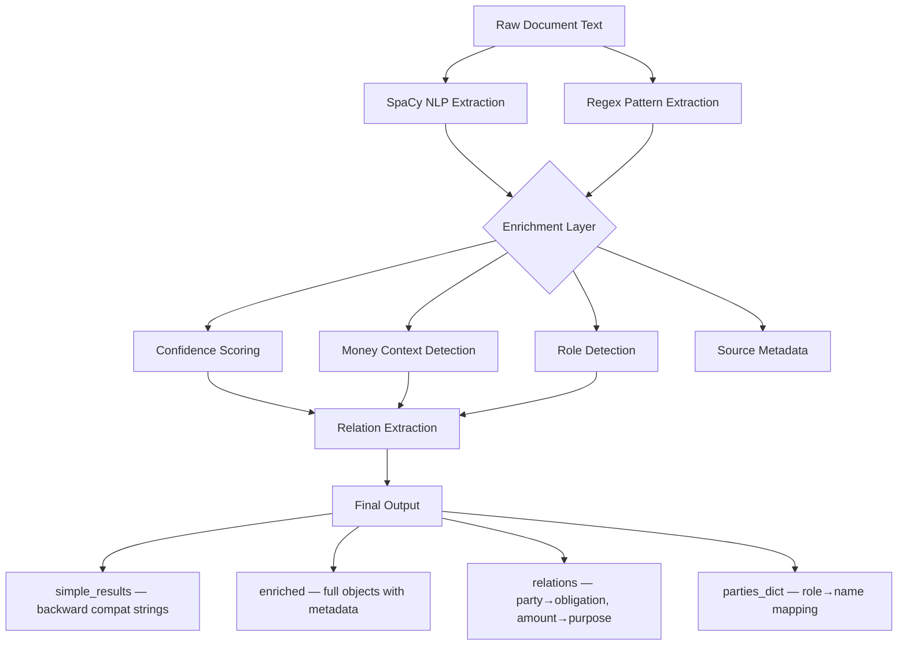

# Entity Intelligence Engine — Upgrade Summary

## Architecture



## Files Modified

| File | Change |
|------|--------|
| [ner.py](file:///d:/legal-ai-analyzer/backend/app/services/ai/ner.py) | Core engine: confidence scoring, contextual money, relations, enriched output |
| [pipeline.py](file:///d:/legal-ai-analyzer/backend/app/services/ai/pipeline.py#L144-L163) | Passes `document_type` to NER, uses structured output directly |
| [clause_detection_service.py](file:///d:/legal-ai-analyzer/backend/app/services/ai/clause_detection_service.py#L34-L76) | Document-agnostic party matching (was hardcoded lessor/lessee) |
| [EntitiesTab.jsx](file:///d:/legal-ai-analyzer/frontend/src/components/documents/EntitiesTab.jsx) | Confidence badges, money-by-type groups, context previews, relations UI |

## Output Format

Every entity now returns:

```json
{
  "text": "Rajesh Kumar",
  "type": "parties",
  "confidence": 0.93,
  "start_char": 120,
  "end_char": 133,
  "metadata": {
    "role": "Buyer"
  }
}
```

Money entities include contextual classification:

```json
{
  "text": "1000000",
  "type": "money",
  "confidence": 0.88,
  "start_char": 450,
  "end_char": 468,
  "metadata": {
    "type": "deposit",
    "context": "security deposit of Rs 10,00,000 for construction rights"
  }
}
```

## Backward Compatibility

> [!IMPORTANT]
> The API is fully backward compatible. The output dict contains **both** formats:

- **Top-level keys** (`parties`, `money`, `dates`, etc.) → flat string lists (same as before)
- **`enriched`** → nested dict with full entity objects
- **`relations`** → list of extracted relationships
- **`parties_dict`** → `{role: name}` mapping for clause detection

Downstream services (clauses, risks, RAG) continue working without changes.

## Confidence Scoring Logic

| Factor | Contribution |
|--------|-------------|
| NLP-detected entity | Base 0.85 |
| Regex-detected entity | Base 0.92 (higher certainty for pattern matches) |
| Context validation present | +0.05 |
| Text length > 5 chars, non-numeric | +0.03 |
| Role detected in context | +0.05 |
| Maximum | Capped at 0.99 |

## Relation Types Extracted

| Type | Pattern | Example |
|------|---------|---------|
| `obligation` | Party + "shall pay/must provide/agrees to" | `Lessee → shall pay monthly rent` |
| `purpose` | Amount + surrounding context sentence | `Rs. 10,00,000 → security deposit for construction` |
| `risk` | Party + "unlimited liability/indemnify/liquidated damages" | `Seller → Associated with indemnity` |
