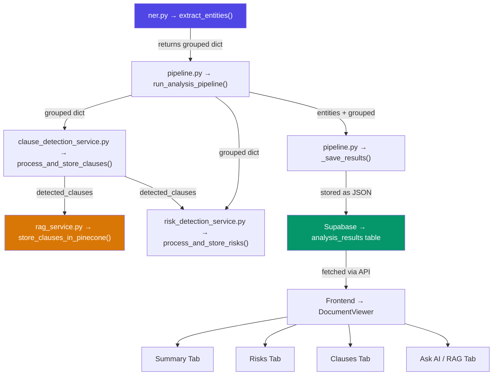

# Entity Extraction — Internal Usage Map

## Data Flow



## Usage by Service

### 1. Pipeline Orchestrator — [pipeline.py:147](file:///d:/legal-ai-analyzer/backend/app/services/ai/pipeline.py#L147)

```python
grouped = await asyncio.to_thread(extract_entities, cleaned_text, document_type)
```

This is the **single entry point**. The pipeline calls `extract_entities()` and passes the result (`grouped`) to every downstream service.

---

### 2. Clause Detection — [clause_detection_service.py](file:///d:/legal-ai-analyzer/backend/app/services/ai/clause_detection_service.py)

**Receives:** `grouped` dict from pipeline ([line 155](file:///d:/legal-ai-analyzer/backend/app/services/ai/pipeline.py#L155))

**Uses these entity keys:**

| Key | How It's Used |
|-----|--------------|
| `parties_dict` | Maps roles (buyer/seller/lessor/lessee) to party names → determines which party each clause applies to ([line 40](file:///d:/legal-ai-analyzer/backend/app/services/ai/clause_detection_service.py#L40)) |
| `money` | Matches financial amounts found in clause text → links amounts to payment/liability clauses ([line 64](file:///d:/legal-ai-analyzer/backend/app/services/ai/clause_detection_service.py#L64)) |

**Output:** List of detected clauses with party + amount metadata attached.

---

### 3. Risk Detection — [risk_detection_service.py](file:///d:/legal-ai-analyzer/backend/app/services/ai/risk_detection_service.py)

**Receives:** `grouped` dict + `detected_clauses` from clause service ([line 158](file:///d:/legal-ai-analyzer/backend/app/services/ai/pipeline.py#L158))

**Uses these entity keys:**

| Key | How It's Used |
|-----|--------------|
| `money` | Compares financial amounts against risk thresholds for the contract type |
| `parties` | Checks for one-sided obligation patterns (single party bearing all risk) |
| `durations` | Evaluates if contract durations are unusually long/short |

**Output:** Risk scores + risk flags shown in the **Risks tab**.

---

### 4. RAG Service — [rag_service.py](file:///d:/legal-ai-analyzer/backend/app/services/ai/rag_service.py)

**Receives:** `detected_clauses` (which already contain entity metadata from step 2) ([line 161](file:///d:/legal-ai-analyzer/backend/app/services/ai/pipeline.py#L161))

**Indirect dependency:** Entity-enriched clauses are stored as vectors in Pinecone → used for semantic Q&A retrieval in the **Ask AI tab**.

---

### 5. Database Storage — [pipeline.py:99-123](file:///d:/legal-ai-analyzer/backend/app/services/ai/pipeline.py#L99-L123)

The full entity output is persisted to Supabase:

```python
analysis_payload = {
    "raw": entities,       # Full NER output (enriched + relations + simple lists)
    "grouped": grouped,    # Same data (grouped reference)
    ...
}
```

Stored in `analysis_results.entities` column → available to the frontend for **all tabs** (Summary, Risks, Clauses, Ask AI).

---

### 6. Frontend (Indirect)

Even though the raw Entities tab is removed, the entity data silently powers:

| Tab | How Entities Help |
|-----|------------------|
| **Summary** | Structured summary sections (parties, financials, obligations) are built from entity data |
| **Risks** | Risk flags reference party names, amounts, and durations from entities |
| **Clauses** | Each clause shows which party it applies to + linked financial amounts |
| **Ask AI** | RAG vectors include entity-enriched clause metadata for better retrieval |

---

## Summary

> [!IMPORTANT]
> `extract_entities()` is called **once** per document. Its output flows to **4 downstream services** and is **persisted to the database**, making it the foundational intelligence layer for the entire application.

The entity engine is **invisible to the user** but **critical to every AI feature**.
